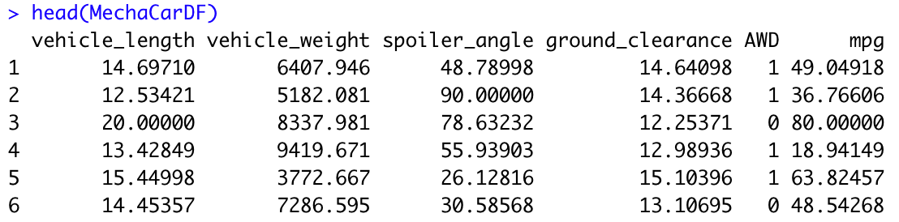
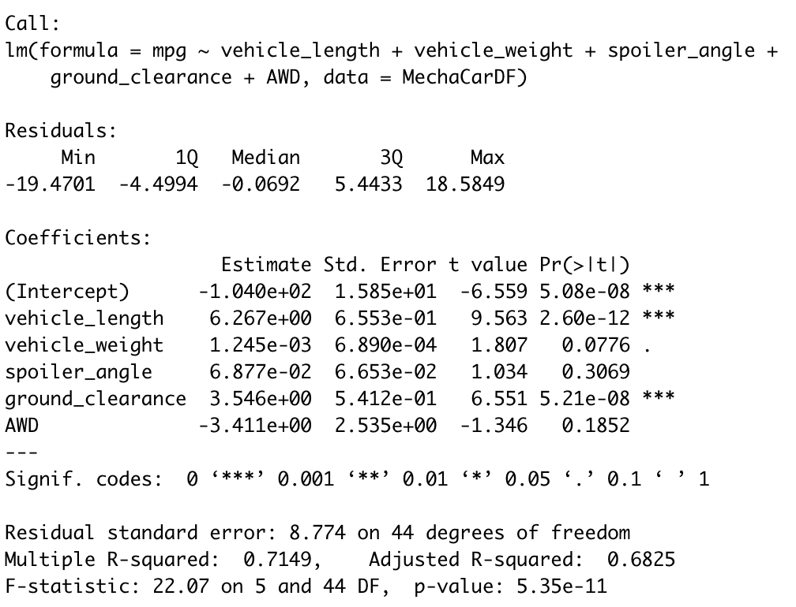

# MechaCar Statistical Analysis

## Purpose
This statistical analysis serves to help an automobile manufacturer determine:
  1. which variables in the dataset of a series of cars predict the mpg of MechaCar prototypes
  2. the summary statistics on the PSI of the suspension coils from 3 different manufacturing lots
  3. if the manufacturing lots are statistically different from the mean population
In addition, we will design a study comparing the MechaCar to other cars

## Linear Regression to Predict MPG
#### DataFrame
The MechaCar_mpg.csv dataset contacts mpg results for 50 prototype MechaCars. The following dataframe show us the six variables for each car: vehicle length, vehicle weight, spoiler angle, ground clearance, drivetrain, and mpg.

#### Linear Model

When we design a linear model on all six variables, we arrive at the following statistical summary:

- The t-value for both vehicle length and ground clearance are high. That means these two variables have a significant impact on mpg. Meanwhile, the vehicle weight, spoiler angle, and presence of AWD have lower t-values that would indicate less or no impact on mpg.
- In this instance, our null hypothesis would be that none of the variables of the MechaCar protoype contribute to a significant change in mpg. If this were the case, the slope of our linear model would be zero and our p-value would be greater than the significance level of 0.05%. However, two variables - vehicle length and ground clearance - have a significant impact on mpg. If we take a look at our p-value, it is far smaller than the significance level of 0.05%, which means we can reject the null hypothesis. The slope of the linear model will not be zero.
- The r-squared value of this linear model is 0.7149, which means that 71.49% of the changes in mpg can be explained by differences in the variables in the model.
