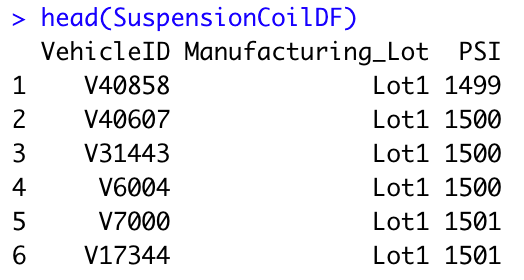
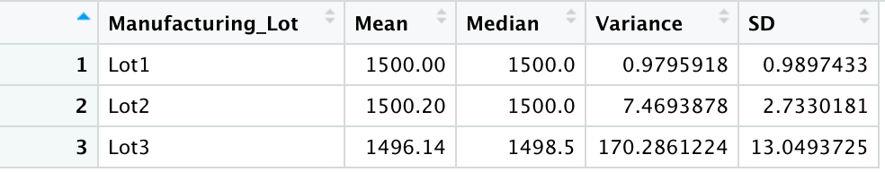
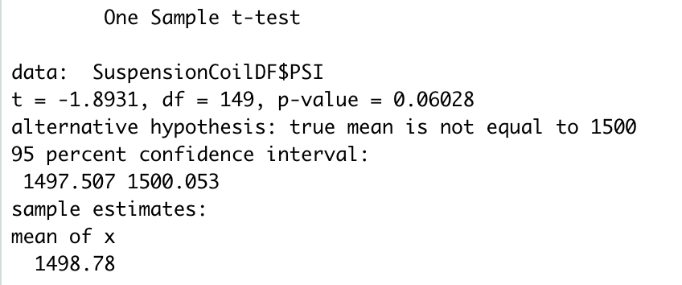
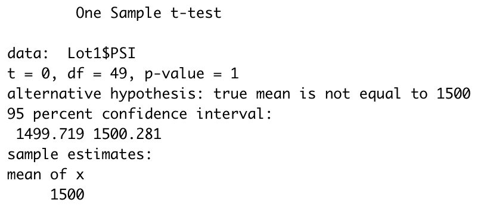
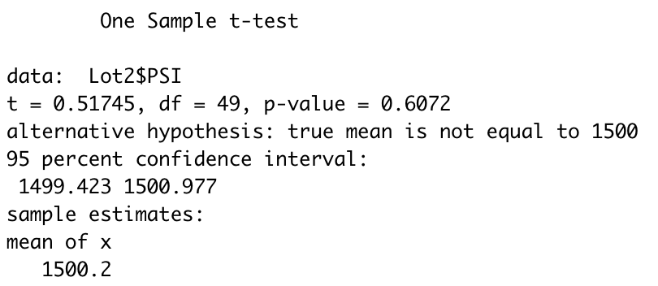
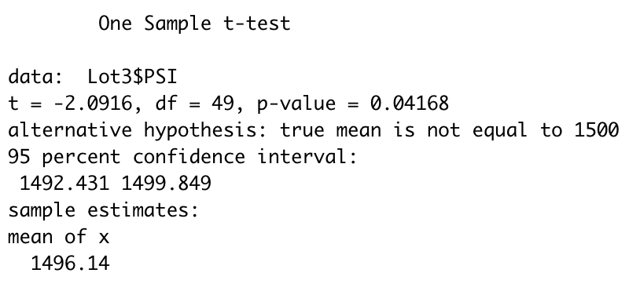

# MechaCar Statistical Analysis

## Purpose
This statistical analysis serves to help an automobile manufacturer determine:
  1. which variables in the dataset of a series of cars predict the mpg of MechaCar prototypes
  2. the summary statistics on the PSI of the suspension coils from 3 different manufacturing lots
  3. if the manufacturing lots are statistically different from the mean population
In addition, we will design a study comparing the MechaCar to other cars

## Linear Regression to Predict MPG
#### DataFrame
The MechaCar_mpg.csv dataset contacts mpg results for 50 prototype MechaCars. The following dataframe show us the six variables for each car: vehicle length, vehicle weight, spoiler angle, ground clearance, drivetrain, and mpg.

#### Linear Model

When we design a linear model on all six variables, we arrive at the following statistical summary:

- The t value for both vehicle length and ground clearance are high. That means these two variables have a significant impact on mpg. Meanwhile, the vehicle weight, spoiler angle, and presence of AWD have lower t values that would indicate less or no impact on mpg.
- In this instance, our null hypothesis would be that none of the variables of the MechaCar protoype contribute to a significant change in mpg. If this were the case, the slope of our linear model would be zero and our p-value would be greater than the significance level of 0.05%. However, two variables - vehicle length and ground clearance - have a significant impact on mpg. If we take a look at our p-value, it is far smaller than the significance level of 0.05%, which means we can reject the null hypothesis. The slope of the linear model will not be zero.
- The r-squared value of this linear model is 0.7149, which means that 71.49% of the changes in mpg can be explained by differences in the variables in the model.

## Summary Statistics on Suspension Coils
#### DataFrame
The Suspension_Coil.csv dataset contains the PSI for different vehicles in three production lots: Lot1, Lot2, and Lot 3.

#### Total Summary
The total summary dataframe summarizes the mean, median, variance, and standard deviation for the PSI of all vehicles in the three lots:

#### Lot Summary
The lot summary dataframe groups these four statistics by manufacturing lot:

#### Variance
The design specifications for MechaCar dictate that the variance of the suspension coils must not exceed 100 pounds per square inch. When we take a look at the three lots together, we see that the variance is 62.29, which does not exceed 100.

When we look at each lot individually, we see that:
1. Lot1: the variance is 0.98, which shows a very small amount of variance
2. Lot2: the variance is 7.47, which is slightly more variance than Lot1, vut still very small
3. Lot3: the variance is 170.29, which is very large, and shows us that Lot3 is impacting the overall variance when we look at the population of prototypes as a whole

## T-Tests on Suspension Coils
#### All Manufacturing Lots
We performed a one sample t-test to see if the mean of all of the three manufacturing lots is statistically similar or dissimilar to the presumed population mean of 1500.

When we look at the results, we notice that the mean of the three lots if 1498.78. As the p-value is 0.06, which is greater than our significance value of 0.05, we do not have enough evidence to reject the null hypothesis. As such, we can say that the mean of the PSI of the manufacturing lots overall is statistically similar to the presumed population mean of 1500.

#### Lot1
We performed a one sample t-test for Lot1.

The mean of the PSI in Lot1 is 1500. With a resulting p-value of 1, the null hypothesis is not rejected, as there is literally zero statistical difference between Lot1's sample mean and the presumed population mean of 1500.

#### Lot2
We performed a one sample t-test for Lot2.

The mean of the PSI in Lot2 is 1500.02. With a resulting p-value of 0.61, the null hypothesis is not rejected, and we are able to say that the sample mean of Lot2 and the presumed population mean of 1500 are statistically similar.

#### Lot3
Finally, we performed a one sample t-test for Lot3.

The mean of the PSI in Lot3 is 1496.14. The p-value is 0.04, which is smaller than our significance value of 0.05. We are able to reject the null hypothesis that the means of the lot and of the population are similar. As such, we are able to determine that the mean of Lot3 and the presumed popopulation mean of 1500 are statistically different.

#### Overall Impressions
While the MechaCar prototypes in Lots 1 and 2 are similar, the prototypes in Lot3 are not.

## Study Design: MechaCar vs. Competition
#### Safety
We would like to see how MechaCar performs against its competition in the category of safety. We first start by determining the metrics that we would use to evaluate safety:
1. Safety ratings as issued by the IIHS overall
2. Safety ratings by model type of MechaCar
3. What sorts of design features impact safety ratings

#### Null Hypothesis and Alternative Hypothesis
We would be interested in evaluating the following:
1. Are MechaCar's safety ratings statistically similar to that of its competitors? Our null hypothesis would be: MechaCar's safety ratings are statistically similar to that of its competitors. To be competitive and to advertise MechaCar as an outstanding option in terms of safety, we would need to compare MechaCar's safety ratings to its competitors, have a p-value smaller than 0.05, which would show that MechaCar's safety ratings are statistically different than its competitors and better. This would prove the alternative hypothesis and put MechaCar on the map.
2. Do the different models of MechaCar's prototypes have statistically similar safety ratings? Our null hypothesis would be: MechaCar's different models have statistically similar safety ratings. We need to compare the safety ratings for the different models of MechaCar and make sure that our ratings are statistically similar, with a p-value greater than 0.05. Therefore we would prove our null hypothesis and can say that all of MechaCar's models are equally safe and each would make a good purchase for consumers who prioritize car safety in their car-buying choices.
3. Do different design features for each model result in variety in safety ratings? Our null hypothesis would be: changing the design features for any of MechaCar's prototypes does not have an impact on safety ratings. To allow for customers to request design changes to their vehicles, we need to prove that design features do not change safety, therefore, all design changes result in statistically similar safety ratings, proving our null hypothesis.

#### Statistical Tests
To prove these hypotheses, we would run t-tests.

#### Data
To run these statistical tests, we would need the following data:
1. MechaCar's safety ratings; safety ratings of other car makes.
2. MechaCar's models and the safety ratings for each model.
3. MechaCar's design features and the impact to safety for these features.

